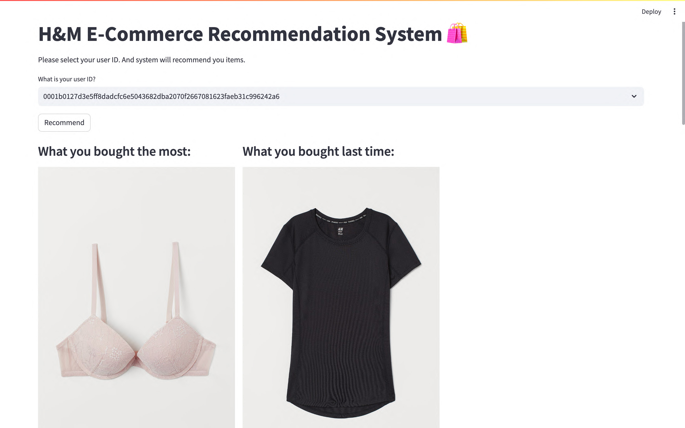
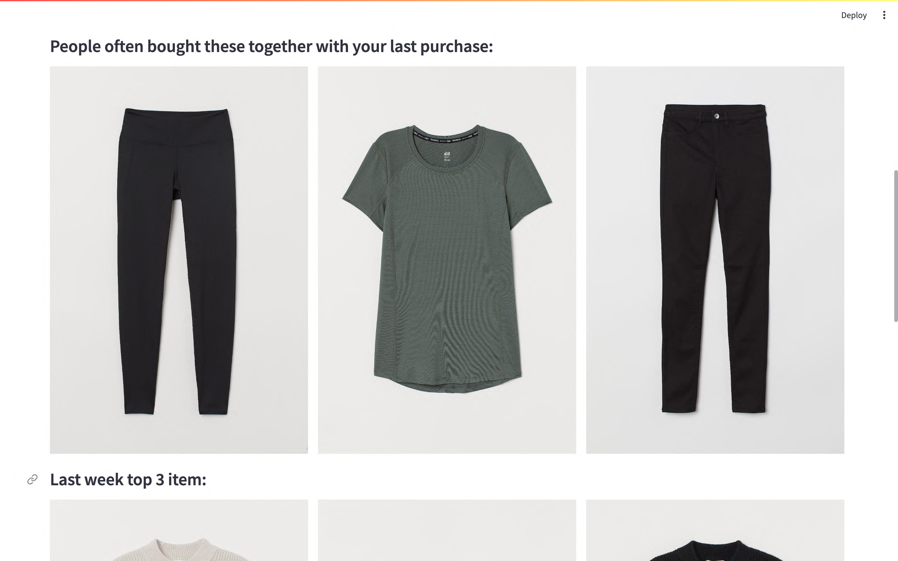
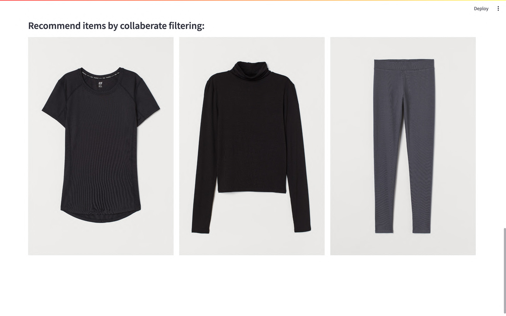

## About 
Introducing the H&M E-commerce Recommendation App. Once you input your user ID, the system will leverage your prior purchase history to provide tailored clothing recommendations for your next purchase. The algorithm behind this app incorporates...
- Last purchase 
- People also buy these items with your last purchases. 
- What you always bought 
- Most popular items by all customers last week 
- Collaborative filtering recommendations 

## Example
 
 
 
